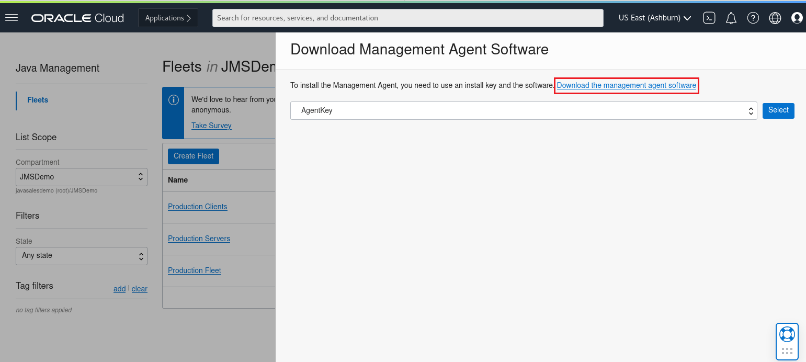
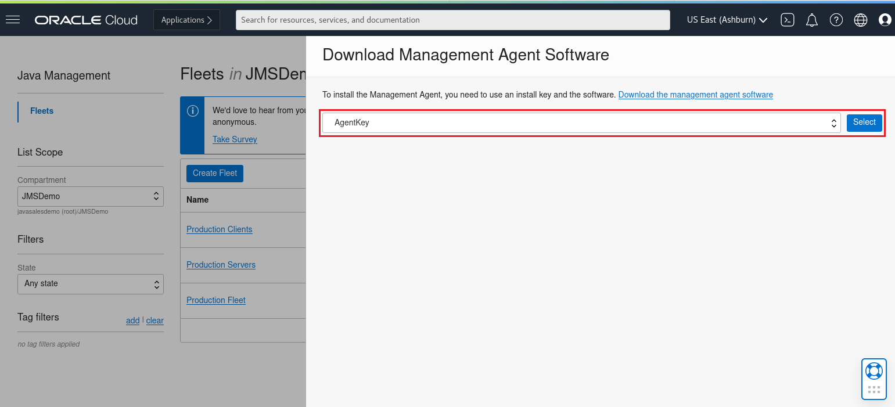

# Installing the Java Management Service Agent on Linux


First, download the Management Agent.

Login to your JMS instance, from the hamburger choose **Observability & Management** -> **Java Management**.


Make certain you're using the proper **Compartment**:


In this example, the **Production Servers Fleet** contains the resources we need.  On the **Production Servers** line entry, click on the dots and choose **Download management agent**:


Click on the link **Download the management agent software**:



Since I'm on a Linux system, I'll choose the **Linux_x86_64** version:


Next, download the Agent key. Once again, on the **Production Servers** line entry, click on the dots and choose **Download management agent**:


In the dropdown, choose **AgentKey**, then **Select**:



Choose **Download**, then **Close**.


Save the file:


After downloading the **Production_Servers_Key.txt** file, make certain the `Service.plugin.jms.download=true` property is uncommented:

```
$ sudo cat /tmp/Production_Servers_Key.txt
########################################################################
# Please refer the following Management Agent Installation Guide for more details.
#
# https://docs.cloud.oracle.com/iaas/management-agents/index.html
#
# Since this file has sensitive information, please make sure that after
# executing setup.sh you either delete this file or store it in a secure
# location.
#
########################################################################
ManagementAgentInstallKey = Mi4wLHVzLWFzaGJ1cm4tMSxvxxx
AgentDisplayName = 
#Please uncomment the below tags properties and provide values as needed
#FreeFormTags = [{"<key1>":"<value1>"}, {"<key2>":"<value2>"}]
DefinedTags = [{"jms":{"fleet_ocid":"ocid1.jmsfleet.oc1.iad.xxx"}}]
ProxyHost = 
ProxyPort = 
ProxyUser = 
ProxyPassword = 
ProxyRealm = 
Service.plugin.jms.download=true   <--- Should be uncommented
```
You should also see a `fleet_ocid` value in the **DefinedTags** entry.

Move the **Production_Servers_Key.txt** file to `/tmp`:

```
$ sudo cp Production_Servers_Key.txt /tmp
```

Next, install the management agent you downloaded in previous steps:

```
$ sudo rpm -ihv oracle.mgmt_agent.rpm 
Verifying...                          ################################# [100%]
Preparing...                          ################################# [100%]
Checking pre-requisites
	Checking if any previous agent service exists
	Checking if OS has systemd or initd
	Checking available disk space for agent install
	Checking if /opt/oracle/mgmt_agent directory exists
	Checking if 'mgmt_agent' user exists
		'mgmt_agent' user already exists, the agent will proceed installation without creating a new one.
	Checking Java version
		JAVA_HOME is not set or not readable to root
		Trying default path /usr/bin/java
		Java version: 1.8.0_271 found at /usr/bin/java
	Checking agent version
Updating / installing...
   1:oracle.mgmt_agent-210823.2233-1  ################################# [100%]

Executing install
	Unpacking software zip
	Copying files to destination dir (/opt/oracle/mgmt_agent)
	Initializing software from template
	Creating 'mgmt_agent' daemon
	Agent Install Logs: /opt/oracle/mgmt_agent/installer-logs/installer.log.0

	Setup agent using input response file (run as any user with 'sudo' privileges)
	Usage:
		sudo /opt/oracle/mgmt_agent/agent_inst/bin/setup.sh opts=[FULL_PATH_TO_INPUT.RSP] 

Agent install successful
```

After the agent is installed, run the script as instructed pointing `opts=` to the Agent key in the `/tmp` directory:

```
$ sudo /opt/oracle/mgmt_agent/agent_inst/bin/setup.sh opts=/tmp/Production_Servers_Key.txt

Executing configure

	Parsing input response file
	Validating install key
	Generating communication wallet
	Generating security artifacts
	Registering Management Agent
		Found service plugin(s): [jms]

Starting agent...
Agent started successfully

Starting plugin deployment for: [jms]
Deploying service plugin(s)...Done.
	jms : Successfully deployed service plugin

Agent setup completed and the agent is running.
In the future agent can be started by directly running: sudo systemctl start mgmt_agent

Please make sure that you delete /tmp/Production_Servers_Key.txt or store it in secure location.
```

To ensure the agent starts after each system reboot, enable the service:

```
$ sudo systemctl enable mgmt_agent
[sudo] password for user: 
```

Notice the status indicates the service is **enabled**:
```
$ sudo systemctl status mgmt_agent
● mgmt_agent.service - mgmt_agent
   Loaded: loaded (/etc/systemd/system/mgmt_agent.service; enabled; vendor preset: disabled)
   Active: active (running) since Tue 2021-09-14 10:45:19 EDT; 5h 31min ago
 Main PID: 6733 (wrapper)
    Tasks: 48 (limit: 72639)
   Memory: 269.2M
   CGroup: /system.slice/mgmt_agent.service
           ├─6733 /opt/oracle/mgmt_agent/agent_inst/bin/./wrapper /opt/oracle/mgmt_agent/agent_inst/bin/..>
           └─6932 /usr/lib/jvm/jdk1.8.0_271/bin/java -Dorg.tanukisoftware.wrapper.WrapperSimpleApp.maxStar>

Sep 14 10:45:07 ol83-srv.example.com systemd[1]: Starting mgmt_agent...
Sep 14 10:45:07 ol83-srv.example.com agentcore[6657]: Starting mgmt_agent...
Sep 14 10:45:14 ol83-srv.example.com agentcore[6657]: Waiting for mgmt_agent.........
Sep 14 10:45:19 ol83-srv.example.com agentcore[6657]: .....running: PID:6733
Sep 14 10:45:19 ol83-srv.example.com systemd[1]: Started mgmt_agent.

```

Configure Java Usage Tracker using the JMS plugin setup by executing the following commands:

```
$ VERSION=$(sudo ls /opt/oracle/mgmt_agent/agent_inst/config/destinations/OCI/services/jms/)
[sudo] password for user: 
$ echo $VERSION
12
```
```
$ sudo bash /opt/oracle/mgmt_agent/agent_inst/config/destinations/OCI/services/jms/"${VERSION}"/scripts/setup.sh
/var/log/java created
/etc/oracle/java/usagetracker.properties created
```

This script creates the file `/etc/oracle/java/usagetracker.properties`.

Now, run any `Java` application.  You should see that `usagetracker` info was added to the log file:

```
$ sudo ls -al /var/log/java
total 8
drwx--x--x.  2 mgmt_agent root   30 Sep 14 10:51 .
drwxr-xr-x. 18 root       root 4096 Sep 14 10:51 ..
-rw-rw-rw-.  1 mgmt_agent root  440 Sep 14 10:56 usagetracker.log
```
```
$ sudo cat /var/log/java/usagetracker.log
"VM start","Tue Sep 14 10:56:59 EDT 2021","my-server.example.com/10.0.1.1","FlightRecorder","/opt/graalvm-ee-java11-21.2.0.1","11.0.12","11.0.12+8-LTS-jvmci-21.2-b08","Oracle Corporation","Oracle Corporation","Linux","amd64","5.4.17-2102.204.4.4.el8uek.x86_64","-XX:+UnlockExperimentalVMOptions -XX:+EnableJVMCIProduct -XX:-UnlockExperimentalVMOptions -XX:ThreadPriorityPolicy=1 ",".","java.runtime.name='Java(TM) SE Runtime Environment' "
```

That's it!  Your system will now begin producing data that JMS will use to help with Java insights.
